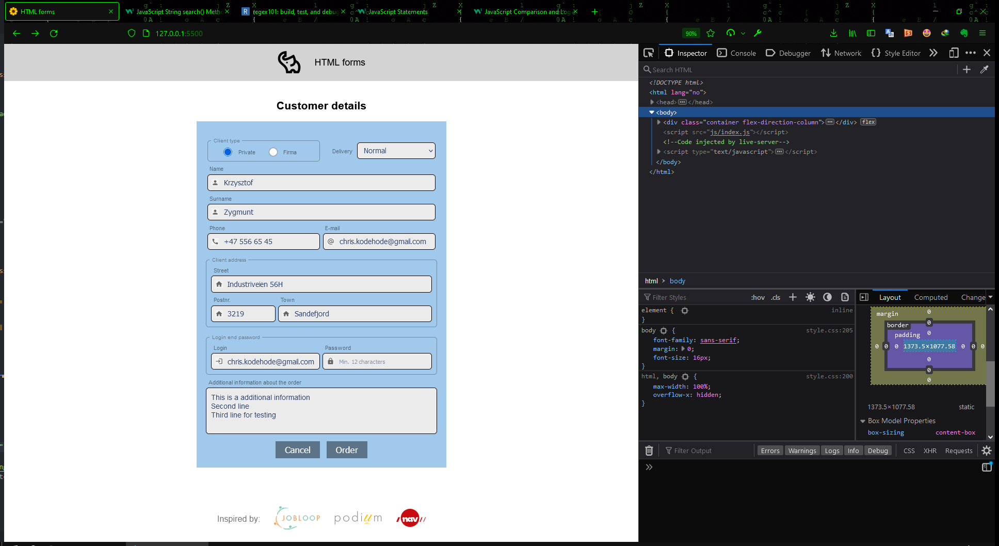
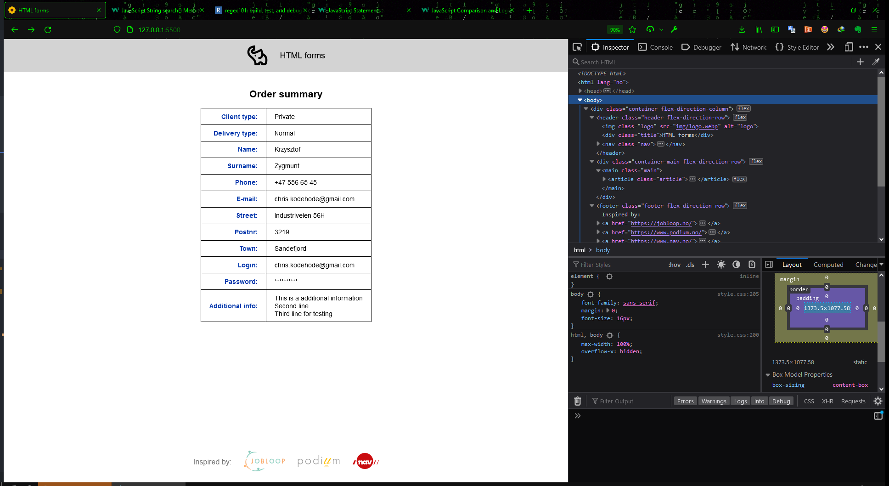

# HTML forms

[Source code](https://github.com/chriskodehub/KH-11_javascript-methodically-looping)  
[Live demo](https://chriskodehub.github.io/KH-11_javascript-methodically-looping/)  

## Oppgave

Design a HTML form using all the Forms which we discussed today in the class.  
The remaining slides in the presentation I will discuss in next class.

## Description

Parsing an html form with JavaScript and DataForm ().  
[Inspiration](https://www.learnwithjason.dev/blog/get-form-values-as-json)

## Result

